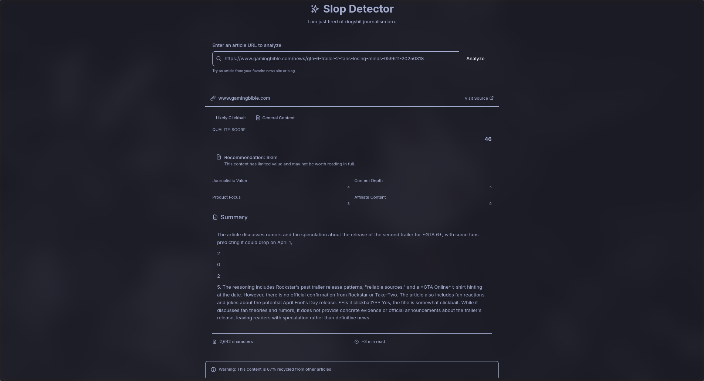
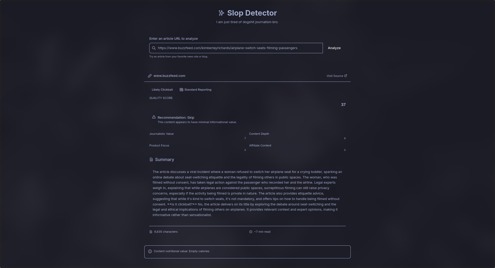

# 🔍 Slop Detector

A modern web application that helps you identify low-quality, clickbait articles and provides concise, useful summaries of web content.




## 🌟 Features

- **Clickbait Detection**: Identifies clickbait headlines and misleading content
- **Content Quality Analysis**: Evaluates articles based on multiple quality metrics
- **Smart Summarization**: Provides concise summaries of article content using AI
- **Content Type Classification**: Identifies product lists, affiliate content, and low-value articles
- **Actionable Recommendations**: Suggests whether to read, skim, or skip content based on quality
- **Tokyo Night Theme**: Beautiful dark theme for comfortable reading

## 💻 How It Works

The Slop Detector analyzes web content through several sophisticated steps:

1. **Content Scraping**: Extracts the main content from a provided URL
2. **AI-Powered Analysis**: Uses the DeepSeek API to generate intelligent summaries
3. **Quality Evaluation**: Applies multiple algorithms to detect clickbait, assess journalistic value, and identify promotional content
4. **Recommendation Engine**: Provides actionable advice based on content quality

## 🔧 Technical Stack

### Frontend
- React 19 with TypeScript
- Tailwind CSS for styling with Tokyo Night theme
- Axios for API requests
- React Icons for UI elements

### Backend
- Node.js with Express
- Cheerio for web scraping
- DeepSeek API for content summarization
- Custom content analysis algorithms

## 🚀 Getting Started

### Prerequisites
- Node.js (v14 or higher)
- npm or pnpm
- DeepSeek API key (get one at [DeepSeek's website](https://deepseek.com))

### Installation

1. Clone the repository:
```bash
git clone https://github.com/notquitethereyet/slop-detector.git
cd slop-detector
```

2. Set up the backend:
```bash
cd backend
npm install

# Create .env file with your API key
echo "PORT=5000
DEEPSEEK_API_KEY=your_deepseek_api_key_here" > .env
```

3. Set up the frontend:
```bash
cd ../frontend
npm install

# Create .env file for frontend
echo "VITE_API_URL=http://localhost:5000" > .env
```

4. Start both servers:
```bash
# In backend directory
npm run dev

# In frontend directory (new terminal)
npm run dev
```

5. Open your browser and navigate to `http://localhost:5173`

## 🧠 Content Analysis Metrics

The application evaluates content using these key metrics:

| Metric | Description | Scale |
|--------|-------------|-------|
| **Journalistic Value** | Assesses source citations, balanced reporting, and depth | 0-10 |
| **Content Depth** | Measures complexity, detail level, and substantive information | 0-10 |
| **Product Focus** | Identifies promotion-heavy content and product lists | 0-10 |
| **Affiliate Content** | Detects affiliate marketing links and shopping content | 0-10 |
| **Quality Score** | Overall quality assessment combining all metrics | 0-100 |

## 🔎 Use Cases

- **Avoid Slop Journalism**: Save time by identifying misleading headlines before reading
- **Research Efficiency**: Quickly determine if an article has substantive information
- **Shopping Content Filter**: Identify articles that are primarily product promotion
- **Information Diet**: Improve your media consumption with higher-quality content

## ⚠️ Limitations

- **Anti-Scraping Measures**: Some websites block web scrapers, which can prevent analysis
- **JavaScript-Heavy Sites**: Content loaded via JavaScript may not be properly scraped
- **Paywalled Content**: The tool cannot access content behind paywalls
- **Rate Limits**: The backend implements rate limiting to prevent abuse

## 🔮 Future Development

### Bypassing Content Restrictions
- Implementing proxy rotation to handle anti-scraping measures
- Headless browser integration for JavaScript-heavy sites
- Browser extension for analyzing content directly in-page

### Enhanced Analysis
- Machine learning model for more accurate content classification
- Support for analyzing images and videos in content
- Historical tracking of website quality over time
- Domain reputation scoring based on past analyses

### User Experience
- User accounts to save article analyses
- Customizable scoring weights based on user preferences
- Mobile app for on-the-go content analysis
- Browser extension for instant analysis while browsing

## 🐛 Troubleshooting

**Common Issues:**

- **"Failed to scrape website"**: The website may have anti-scraping measures. Try a different URL.
- **"API key is not configured"**: Ensure your DeepSeek API key is correctly set in the backend .env file.
- **"Request timeout"**: The website might be too large or slow to process. Try again or use a different URL.

## 🤝 Contributing

I'd be amused if you actually wanted to contribute to my codebase, lol.

1. Fork the repository
2. Create a feature branch: `git checkout -b feature/amazing-feature`
3. Commit your changes: `git commit -m 'Add some amazing feature'`
4. Push to the branch: `git push origin feature/amazing-feature`
5. Open a Pull Request

## 📝 License

Do whatever you want, lil bro.

## 🙏 Acknowledgements

- [DeepSeek API](https://deepseek.com) for providing the AI summarization capabilities
- [React](https://react.dev/) and [Tailwind CSS](https://tailwindcss.com/) for frontend development
- [Cheerio](https://cheerio.js.org/) for web scraping capabilities